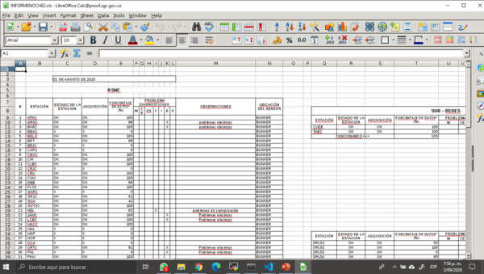
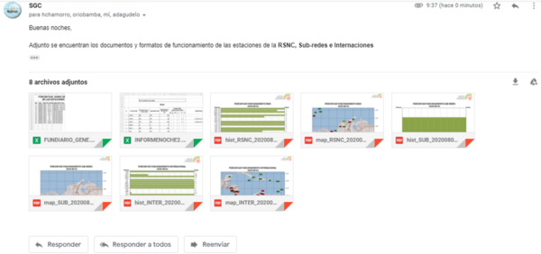

# SGC_noche 

Rutina realizada para enviar correos con el funcionamiento de las estaciones de la RSNC, RNAC, DRL, SUB, INTER

**SI ESTA EN EL PROC 4, NO ES NECESARIO REVISAR LA SECCIÓN DE INSTALACIÓN**

## 1. Instalación en linux

Asegurate de hacer lo siguiente para poder correr basemap, para que se pueda abrir pdfs con evince y los excel con libreoffice.

### Requerimientos previos
Se corre en sistemas linux.

### - Python
Python Versión 3.6 o Versión 3.7

#### - Servidor SMTP
Tener un servidor SMTP *(Simple Mail Transfer Protocol)* el cual es un protocolo básico que permite que los emails viajen a través de Internet. 

#### - libgeos
```bash
sudo apt-get install libgeos-dev #para basemap
cd /usr/lib
sudo ln -s libgeos-3.3.3.so libgeos.so
sudo ln -s libgeos-3.3.3.so libgeos.so.1
```
#### - evince
```bash
sudo apt-get install evince # para abrir pdfs
```
#### - libreoffice 
```bash
sudo apt-get install libreoffice #para abrir excel

```


### Instalación con pip 

```bash
conda deactivate #En caso de que haya un ambiente de anaconda activo
pip install virtualenv 
virtualenv .noche_venv
source .noche_venv/bin/activate
pip install -r requirements.txt
```

### Instalación con anaconda
```bash
conda env create -f noche_env.yml
conda activate noche_env
```

## 2. Arquitectura

### 1. Archivos:

- **funest.py**: Archivo que contiene la clase *SGC_Performance*. Tiene un método llamado *create_json* que genera los json de funcionamiento.

- **utils_noche.py**: Contiene todas las funciones útiles que se usan para crear json,txt,mapas,excel, correos.

- **run_noche.py**: Archivo de ejecución para la rutina de la noche. Importa las funciones de utils_noche.py

### 2. noche_store:

- **correo**: Carpeta donde se guarda los archivos para enviar correos: destinatarios,
            formatos de mensajes y las credenciales de rsncol
- **excel**: Carpeta donde se guarda los 2 excel que se envían: FUNDIARIO_GENE.xls y INFORMENOCHE2.xls. 
            Este último archivo debe estar actualizado a la fecha que se vaya a correr
- **fonts**: Carpeta donde se guarda las fuentes del SGC
- **histogramas**: Carpeta donde se guarda los pdfs de histogramas
- **jsons**: Carpeta donde se guarda los jsons que se generan
- **logos**: Carpeta donde se guarda los logos que se adicionan en los pdfs
- **maps**: Carpeta donde se guarda los pdfs de mapas
- **on_stations**: CARPETA DONDE SE GUARDAN LOS ARCHIVOS .in 
                QUE CONTIENE LAS ESTACIONES A LAS QUE SE VA A CALCULAR LA RUTINA DE LA NOCHE
- **pdf_noche**: Carpeta donde se guarda los pdfs que observan los analistas al correr la noche
- **problemas**: Carpeta donde se guarda los problemas que se generan 
- **txt**: Carpeta donde se guarda los txt de funcionamiento


## 3. Demostración en el proc4

Desde cualquier usuario del proc4, puede correr la rutina de la noche. 

Diríjase a la siguiente ruta 

```bash
cd /opt/Rutina_Noche/
```

Allí encuentra dos carpetas importantes: 

**- SGC_noche** : REPOSITORIO QUE CONTIENE LA RUTINA DE LA NOCHE

**- rutina_noche** : AMBIENTE VIRTUAL DE TRABAJO DE LA RUTINA DE LA NOCHE

<p align="center"></p>


### 1. Activar el ambiente de trabajo

```bash
source rutina_noche/bin/activate
```

A continuación se activa el ambiente de trabajo. Para comprobarlo en la parte izquierda tiene que tener (rutina_noche)

<p align="center">

</p>

Luego de activar el ambiente, nos diríjimos al repositorio SGC_NOCHE

```bash
cd SGC_noche
```

Dentro del repositorio, va a encontrar los archivos y carpetas necesarias para correr la rutina de la noche. Principalmente, nuestro interés esta en el archivo **run_noche.py**. Para ejecutarlo:

```bash
python run_noche.py
```

**Nota** : Recuerde que en /noche_store/on_stations estan los archivos.in donde pueden añadir y eliminar estaciones de la respectiva red.

### 1. **Fecha**: 
Solicita la fecha para ver el funcionamiento de estaciones en ese día.

```bash
fecha YYYYMMDD:  20200801
```

### 2. **Json**:
 Una vez digitada empezará a cargar el *archivo json*. **El tiempo que demora la generación del archivo depende del número de gaps en las estaciones en las distintas redes. En general, demora de 2 a 3 minutos.**. *Se hizo lo posible por disminuir el tiempo calculando los porcentajes en paralelo.*

```bash
...loading json: 20200801
```

**Nota** : Si el archivo.json ya ha sido creado, el pregunta si lo queire volver a crear, o quiere continuar con la información que ya existe.

### 3. **Txt**: 
De manera inmediata, con el editor *nano* se abren los *archivos txt* de las respectivas redes. En este punto se puede revisar que los porcentajes de las estaciones concuerden con el checklist. En caso de que todo este bien se hace lo siguiente:

```bash
Ctrl + o  | Enter   # Para guardar
Ctrl + x            # para salir
```

<p align="center">

</p>

Luego, se abre el siguiente *archivo txt* de la siguiente red. Así hasta terminar las respectivas redes.

### 4. **Mapas & histogramas**: 
En este punto se crean los respectivos mapas e histogramas. *En esta versión la generación de mapas depende del servidor arcgisonline. Por tanto, por ahora SE NECESITA INTERNET PARA QUE SE GENEREN LOS MAPAS*. **El tiempo que demora la generación de los mapas depende del internet, se hace en paralelo para mejorar rendimiento.**

```bash
...loading maps: 20200801
```

Luego, de manera inmediata se abre un *archivo pdf*. El único objetivo de este es que el analista sea capaz de visualizar  en una sola pasada todos los mapas y todos los histogramas de las redes. Si todo esta bien solo cerrar el pdf.

<p align="center">

</p>

### 5. **Excel**: 
Se abren dos archivos excel:

    - FUNDIARIO_GENE.xls : Archivo que guarda el historial de funcionamiento de la red.
    - INFORMENOCHE2.xls : Archivo que contiene el funcionamiento del presente día en que se corre la rutina.

<p align="center">

</p>

La idea es copiar el porcentaje de funcionamiento de las estaciones de la RSNC del archivo INFORMENOCHE2.xls en la respectiva fecha del archivo FUNDIARIO_GENE.xls. Revisar que el orden de las estaciones corresponda en cada excel. 

Una vez todo este bien, cerrar los archivos guardando los cambios.

### 6. **Correo**:
Se envian los correos. Aparece lo siguiente en la terminal:

```bash
¿Desea enviar correos?
         1 [si]      0 [no]
```

En caso de *1 [si]* se envían los respectivos correos  a los destinatarios según el archivo *destinatario_noche.json* en la ruta noche_store/correo. 

<p align="center">

</p>

En caso de *0 [no]*  aparece lo siguiente:

```bash
¿Desea informar el problema?.
         1 [si]      0 [no]
```

En caso de *1 [si]* se abre un *archivo txt* donde puede escribir cuál es el problema. Luego Cntrl + O para guardar y Cntrl + x para guardar. Luego se envia un correo con el problema a los destinatarios según el archivo *destinatario_problema.json* en la ruta noche_store/correo.

 En caso de *0 [no]*  se anula todo, y termina la rutina.

 ## Autores
 - Ángel Daniel Agudelo adagudelo@sgc.gov.co
 - Emmanuel David Castillo ecastillo@sgc.gov.co

 *creación: 2020/02/01*
 
 *última actualización: 2020/09/03*
